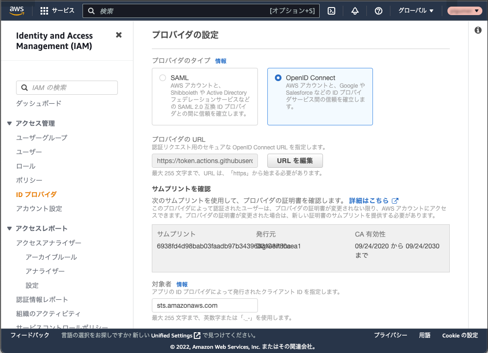

GitHub Actions で mustache テンプレートアクションを使用する方法
===

## GitHub の OIDC プロバイダを使用して AWS にアクセスする

最初に GitHub の OIDC プロバイダを使って AWS にアクセスする方法から。

- AWS Identity and Access Management (IAM) の ID プロバイダに GitHub を追加する
- 追加した外部 ID プロバイダをプリンシパルとする IAM ロールを作成する
- 作成した IAM ロールを使用する GitHub Actions ワークフローを記述する

### 1. AWS Identity and Access Management (IAM) の ID プロバイダに GitHub を追加

IAM の「アクセス管理」にある「ID プロバイダ」を選択し、「プロバイダを追加」ボタンをクリックします。

画面のように、「OpenID Connect」を選択し、プロバイダの URL に `https://token.actions.githubusercontent.com`、対象者を `sts.amazonaws.com` と入力して「プロバイダを追加」ボタンをクリックします。



### 2. 追加した外部 ID プロバイダをプリンシパルとする IAM ロールの作成

作成した ID プロバイダをプリンシパルに設定したロールを作成します。

ロールの「信頼関係」は次のようになります。

```json
{
    "Version": "2012-10-17",
    "Statement": [
        {
            "Effect": "Allow",
            "Principal": {
                "Federated": "arn:aws:iam::{AWS Account ID}:oidc-provider/token.actions.githubusercontent.com"
            },
            "Action": "sts:AssumeRoleWithWebIdentity",
            "Condition": {
                "StringLike": {
                    "token.actions.githubusercontent.com:sub": "repo:{GitHub User/Organization}/{Repository Name}:*"
                }
            }
        }
    ]
}
```

AWS Account ID、GitHub User/Organization、Repository Name は使用する環境の値に置換してください。

ロールの「許可」は GitHub Actions にアクセスを許可する AWS サービスのポリシーを設定します。ここでの例のように S3 にファイルをコピーする場合は「AWSLambdaExecute」のような AWS 管理ポリシーが使用可能です。

### 3. ロールの登録と GitHub Actions のワークフローの記述

GitHub リポジトリの Settings タブ - Security - Secrets の Actions を選択して、「New repository secret」ボタンをクリックします。

この例では、Name を「AWS_ROLE_ARN」と入力し、Secret に 2 で作成したロールの ARN を設定して「Add secret」ボタンをクリックします。

ここまでで AWS の認証情報が取得可能かを確認するワークフローは次のようになります。

```yaml
name: example

on:
  push:
    branches: [ main ]

permissions:
  id-token: write

jobs:
  build:
    runs-on: ubuntu-latest
    steps:
      - name: Git clone the repository
        uses: actions/checkout@v3
      - name: configure aws credentials
        id: credentials
        uses: aws-actions/configure-aws-credentials@v1
        with:
          role-to-assume: ${{ secrets.AWS_ROLE_ARN }}
          aws-region: "ap-northeast-3"
```

認証情報 (Credentials) が取得できれば、このワークフローが成功します。

## テンプレートエンジンの使用

例として次のようなテンプレートファイル (`templates/example.yaml`) を記述してみます。

```yaml
aws:
  AWS_ACCOUNT_ID: {{ ENV }}
```

このテンプレートファイルを処理するワークフローは次のようになります。

```yaml
name: example

on:
  push:
    branches: [ main ]

permissions:
  id-token: write

jobs:
  build:
    runs-on: ubuntu-latest
    steps:
      - name: Git clone the repository
        uses: actions/checkout@v3
      - name: configure aws credentials
        id: credentials
        uses: aws-actions/configure-aws-credentials@v1
        with:
          role-to-assume: ${{ secrets.AWS_ROLE_ARN }}
          aws-region: "ap-northeast-3"
      - uses: edgardleal/mustache-template-action@v1.0.4
        env:
          ENV: ${{ steps.credentials.outputs.aws-account-id }}
        with:
          input: templates/example.yaml
          output: example.yaml 
```

ここでは、テンプレートエンジンのアクションに [mustache-template-action](https://github.com/edgardleal/mustache-template-action) を使用しました。
テンプレートは、このアクションへの環境変数の値で置換されて、output に指定されたパスのファイルが生成されます。

### アクションの出力 (OUTPUT) について

ここで AWS Actions の [configure-aws-credentials](https://github.com/aws-actions/configure-aws-credentials) を題材に GitHub Actions をもう少し詳しく説明します。

上記のワークフローにある `${{ steps.credentials.outputs.aws-account-id }}` についてです。

GitHub Actions ではフローの実行結果の状態 (STATE) や出力 (OUTPUT) を他のフローに連携できます。
つまり、上の例のように `id: credentials` フローの出力を `steps.credentials.outputs` のプレフィックスと `aws-account-id` のキーで取得できます。

注:

状態や出力は、それぞれ `save-state` と `set-output` コマンドが使用されてきました。
これらは「[GitHub Actions: Deprecating save-state and set-output commands](https://github.blog/changelog/2022-10-11-github-actions-deprecating-save-state-and-set-output-commands/)」に書かれている通り最近非推奨となりました。
それぞれ GITHUB_STATE 環境変数に設定されたファイルへの追記、GITHUB_OUTPUT 環境変数に設定されたファイルへの追記に変更することが要求されています。

アクションそれぞれがどのような値を出力しているかは、アクションのリポジトリ内のファイル `action.yml` に書かれています。

configure-aws-credentials では、[action.yml](https://github.com/aws-actions/configure-aws-credentials/blob/master/action.yml) の次の部分が該当します。

```yaml
outputs:
  aws-account-id:
    description: 'The AWS account ID for the provided credentials'
```
